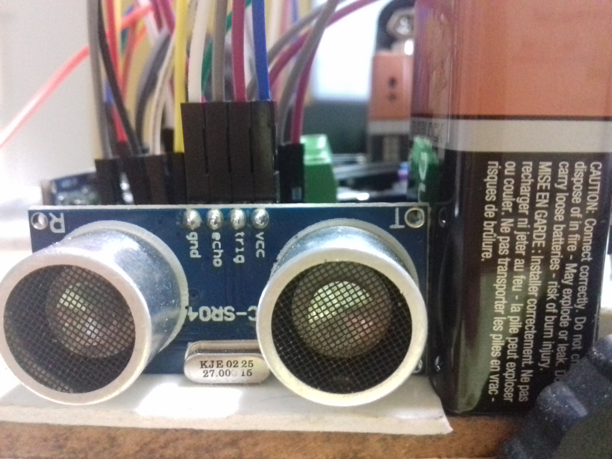

# Arduinox

A maze solving robot based on the Arduino microcontroller.
 
ArduinoX is a competition held at BITS pilani, pilani campus during the Apogee tech fest.
 
In this competition, Arduino code has to be written for a maze-solving robot so that the robot is able to successfully navigate a maze in the shortest time possible.

This bot uses an Arduino Uno microcontroller, 3 ultrasonic sensors, 2 dc motors, 2 l293d motor drivers among other basic materials required to build a general maze-solving bot.

Video of the maze solving bot-

https://www.youtube.com/watch?v=dGZhKkRfbiM
 
 

